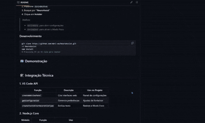

**NeuroAssist: Extensão VS Code para Leitura Acessível**

[](https://marketplace.visualstudio.com/items?itemName=YourUsername.NeuroAssist)
[](https://marketplace.visualstudio.com/items?itemName=YourUsername.NeuroAssist)
[](LICENSE)

---

## 📖 Descrição

O **NeuroAssist** é uma extensão inovadora para o Visual Studio Code, projetada para tornar a leitura e a escrita de código mais confortáveis e acessíveis. Ideal para desenvolvedores que buscam maior clareza visual e personalização, ela oferece:

* **Configurações Visuais**: Ajuste de fonte (incluindo suporte à OpenDyslexic), tamanho de texto, cor do texto, espaçamento entre linhas e letras para reduzir a fadiga ocular.
* **Modo Foco**: Destaque automático dos trechos de código selecionados, escurecendo o restante do editor para aumentar a concentração.
* **Marcação Dinâmica**: Ferramenta de marcação de texto que permite destacar partes específicas do código com a cor escolhida.
* **Gerenciamento de Variáveis via WebView**: Crie, liste e atualize variáveis personalizadas diretamente na interface web da extensão.

Com o NeuroAssist, você pode transformar seu ambiente de desenvolvimento num espaço mais confortável e adaptado às suas necessidades, especialmente se você busca maior legibilidade ou apresenta dificuldades de leitura.

---

## 🚀 Instalação

### 1. Instalação Local (Desenvolvimento)

1. **Clonar o repositório**:

   ```bash
   git clone https://github.com/mari-ww/NeuroAssist.git
   cd NeuroAssist
   ```

2. **Instalar dependências**:

   ```bash
   npm install
   ```

3. **Compilar (se necessário)**:

   > Caso você use ferramentas de build ou transpilações, execute o script apropriado. Exemplo:

   ```bash
   npm run compile
   ```

4. **Carregar a extensão no VS Code**:

   * Abra o VS Code.
   * Pressione `F5` para iniciar uma nova janela de desenvolvimento com a extensão carregada.
   * Na nova janela, você verá a extensão **NeuroAssist** disponível.

### 2. Instalação via Marketplace

1. Abra o **Visual Studio Code**.
2. Acesse a seção **Extensões** (`Ctrl+Shift+X`).
3. Pesquise por `NeuroAssist` ou use `mari-ww.NeuroAssist`.
4. Clique em **Instalar**.
5. Após a instalação, pressione `Ctrl+Alt+S` para abrir o painel de configurações visuais ou `Ctrl+Alt+F` para alternar o modo foco.

---

## 📺 Demonstração

<p align="center">
  <!-- Substitua `demo.gif` pelo caminho real do GIF ou imagem demonstrativa -->
  
</p>

> *GIF ilustrando a abertura do painel de configurações, ajustes de fonte e ativação do modo foco.*

---

## 🛠️ Documentação Técnica das APIs Utilizadas

Abaixo está um detalhamento técnico das principais APIs e módulos que fazem a NeuroAssist funcionar.

### 1. VS Code API (*vscode*)

* **`vscode.window.activeTextEditor`**: Obtém o editor de texto atualmente ativo.
* **`vscode.window.showInformationMessage(message)`** e **`vscode.window.showWarningMessage(message)`**: Exibição de notificações ao usuário.
* **`vscode.workspace.getConfiguration(section)`**: Acesso às configurações do VS Code (ex.: `editor`, `workbench`, `NeuroAssist`).
* **`configuration.update(key, value, target)`**: Atualiza configurações globais ou de workspace. Usado para alterar `fontFamily`, `fontSize`, `letterSpacing`, `lineHeight` e `colorCustomizations`.
* **`vscode.window.createTextEditorDecorationType(options)`**: Cria estilos de decoração (ex.: realce de fundo e cor de texto). Utilizado tanto para marcações manuais quanto para o modo foco.
* **`editor.setDecorations(decorationType, ranges)`**: Aplica decorações às faixas de texto selecionadas.
* **`vscode.commands.registerCommand(commandId, callback)`**: Registra comandos personalizáveis (`NeuroAssist.showSettingsPanel`, `NeuroAssist.toggleFocusMode`, etc.).
* **`vscode.window.createWebviewPanel(viewType, title, showOptions, options)`**: Cria um painel WebView para exibir a interface HTML de configurações.
* **`panel.webview.postMessage(message)`** e **`webview.onDidReceiveMessage(callback)`**: Comunicação bidirecional entre a extensão e o WebView.
* **`vscode.workspace.getConfiguration('NeuroAssist').get('focusModeBackground')`**: Recupera configurações específicas definidas pelo usuário na seção `NeuroAssist` do `settings.json`.

### 2. Node.js API

* **`require('os')`**: Módulo que detecta o sistema operacional (*Windows, macOS, Linux*) para escolher a fonte padrão correta.
* **`os.platform()`**: Retorna `'win32'`, `'darwin'` ou `'linux'`, usado no `restoreDefaultSettings`.

### 3. Decorators & WebView

* **Criação de Decorações de Texto**:

  * `createMarkingDecoration(color)` e `focusDecoration = vscode.window.createTextEditorDecorationType({ ... })` definem estilos visuais para marcações e modo foco.
  * **Parâmetros principais**:

    * `backgroundColor`: Define cor de fundo da decoração.
    * `color`: Define cor do texto (usado somente no modo foco para escurecer o texto ao fundo escuro).
    * `isWholeLine`: Quando `true`, aplica a decoração em toda a linha.

* **Comunicação com o WebView**:

  * O arquivo `webviewContent.js` gera HTML dinâmico para o painel de configurações, incluindo elementos `<select>`, `<input>` e botões que enviam mensagens via `vscode.postMessage({ command, ... })`.
  * No lado da extensão, `settingsPanel.webview.onDidReceiveMessage` recebe comandos como `saveSettings`, `restoreDefaults`, `markText`, `clearMarking` e `updateFocusOpacity`.

### 4. Módulos Customizados

#### 4.1. `editorActions.js`

* **`saveSettings(font, fontSize, color, letterSpacing, lineHeight)`**:

  1. Verifica disponibilidade da fonte (caso de "OpenDyslexic").
  2. Atualiza configurações do editor (`fontFamily`, `fontSize`, `letterSpacing`, `lineHeight`).
  3. Atualiza `colorCustomizations` em `workbench` para mudar a cor do texto.

* **`markText(color)`**:

  1. Verifica se há seleção ativa no editor.
  2. Cria um `TextEditorDecorationType` para destacar o texto selecionado com a cor escolhida.
  3. Armazena a decoração em `currentDecorations` para futura limpeza.

* **`clearMarking()`**:

  1. Limpa todas as decorações armazenadas em `currentDecorations`.
  2. Disposa cada decoração para liberar recursos.

* **`restoreDefaultSettings(panel)`**:

  1. Detecta o sistema operacional para escolher a fonte padrão (`Consolas`, `Monaco` ou `Ubuntu Mono`).
  2. Restaura `fontFamily`, `fontSize`, `letterSpacing` e `lineHeight` para valores padrão.
  3. Ajusta `colorCustomizations` de acordo com o tema atual (texto branco em tema escuro).
  4. Envia uma mensagem ao WebView com `panel.webview.postMessage({ command: 'restoreDefaults', ... })` para que a interface retorne aos valores padrão.

#### 4.2. `variableManager.js`

* **Estrutura de Dados**:

  ```js
  /** @type {Variable[]} */
  const variables = [];
  ```

  Onde `Variable` é um objeto com:

  * `name` (string): nome da variável;
  * `type` (string): tipo da variável (`string`, `number`, `boolean`, `object`, `array`, `any`);
  * `value` (\*): valor atual da variável.

* **Funções Principais**:

  * `addVariable(name, type, value)`:

    * Valida se `name` e `type` foram preenchidos.
    * Verifica duplicidade pelo nome.
    * Checa se `value` corresponde a `type` (usando `isValueOfType`).
    * Adiciona a variável ao array `variables`.
  * `updateVariable(name, newValue)`:

    * Busca a variável pelo `name`.
    * Valida se `newValue` corresponde ao tipo original.
    * Atualiza `value`.
  * `listVariables()`:

    * Retorna uma cópia do array `variables` para evitar manipulação direta.
  * `removeVariable(name)`:

    * Encontra o índice da variável a ser removida e a elimina.
  * `isValueOfType(value, type)`:

    * Verifica, via `typeof` ou `Array.isArray`, se o valor corresponde ao tipo esperado. Retorna `true` ou `false`.

#### 4.3. `webviewContent.js`

* **`getWebviewContent(variables = [])`**:

  * Gera HTML dinâmico para o painel de configurações.
  * Define `@font-face` para `Lexend` e `OpenDyslexic`, carregados via caminho `vscode-resource:/fonts/...`.
  * Elementos HTML:

    * **Seletor de Fonte** (`<select id="font">`) preenchido dinamicamente pelo WebView (ainda será populado via script se necessário).
    * **Inputs** para `fontSize`, `color`, `lineHeight`, `letterSpacing` e `focusOpacity`.
    * **Botões**: "Salvar Configurações", "Restaurar para Padrão", "Marcar Código" e "Limpar Marcação".
    * **Tabela de Variáveis**: Exibe `variables` como `<tr><td>...</td></tr>`.
  * **Scripts**:

    * `vscode.postMessage({ command, ... })` envia comandos para a extensão.
    * `window.addEventListener("message", ...)` recebe mensagens para atualizar tema (`setTheme`) e a tabela de variáveis (`updateVariables`).

#### 4.4. `extension.js`

* **Ponto de Entrada**:

  * Função `activate(context)` registra comandos:

    1. **`neuroassist.toggleFocusMode`**: Chama `toggleFocusMode()`, que alterna entre aplicação e limpeza do modo foco.
    2. **`neuroassist.showSettingsPanel`**: Cria ou revela o painel WebView, carrega HTML via `getWebviewContent(listVariables())` e configura listeners.
    3. **`neuroassist.addVariable`**: Prompts (`showInputBox` e `showQuickPick`) para criar variáveis e atualiza o WebView.
    4. **`neuroassist.listVariables`**: Imprime tabela de variáveis no console para depuração.
  * **`toggleFocusMode()`**:

    * Se `focusModeActive` estiver `true`, chama `clearFocusMode()`, caso contrário, `applyFocusMode(editor)`.
    * `applyFocusMode(editor)`:

      * Cria duas decorações: `currentDecoration` (transparente) e `focusDecoration` (preto translúcido).
      * Chama `updateFocus(editor)` para aplicar efeitos às linhas selecionadas.
      * Inscreve em `onDidChangeTextEditorSelection` para atualizar foco conforme o cursor se move.
    * `updateFocus(editor)`:

      * Identifica as linhas ativas (selecionadas) e armazena em `activeLinesSet`.
      * Para cada linha não ativa, aplica `focusDecoration` (escurecendo).
      * Para cada linha ativa, aplica `currentDecoration` (mantendo transparência).
    * `clearFocusMode()`:

      * Remove/dispõe a decoração de foco.

* **Configuração (`package.json`)**:

  * Comandos: `neuroassist.showSettingsPanel`, `neuroassist.toggleFocusMode`, `neuroassist.addVariable`, `neuroassist.listVariables`.
  * **Keybindings**:

    * `Ctrl+Alt+S`: Abre painel de configurações.
    * `Ctrl+Alt+F`: Alterna modo foco.
  * **Configurações Padrão** (`contributes.configuration`):

    * `neuroassist.focusModeBackground`: Cor de fundo do modo foco.
    * `neuroassist.focusModeOpacity`: Opacidade do modo foco.
    * `neuroassist.font`, `neuroassist.fontSize` e `neuroassist.color`: Parametrizações iniciais de fonte e cor.

---

## 📑 Documentação Técnica das APIs de Terceiros

Além das APIs do VS Code e Node.js, a extensão utiliza:

* **Axios** (`"axios": "^1.7.9"`): Biblioteca HTTP para requisições externas (até o momento, não usada diretamente no código apresentado, mas preparada para futuras integrações).
* **Fast XML Parser** (`"fast-xml-parser": "^4.5.1"`): Parser de XML para JavaScript (também configurado para futuras funcionalidades de importação/exportação de dados em XML).

Para instalar dependências adicionais:

```bash
npm install axios fast-xml-parser
```

> Ambas as bibliotecas fazem parte de `package.json`, mas não são essenciais para o funcionamento atual. Elas estão disponíveis caso você adicione recursos de requisições HTTP ou parsing de XML.

---

## ✅ Badges e Links Úteis

* **Marketplace**: [NeuroAssist no VS Code Marketplace](https://marketplace.visualstudio.com/items?itemName=YourUsername.NeuroAssist)
* **Repositório GitHub**: [https://github.com/SeuUsuario/NeuroAssist](https://github.com/SeuUsuario/NeuroAssist)
* **Issues**: [Área de Issues no GitHub](https://github.com/SeuUsuario/NeuroAssist/issues)
* **Documentação Oficial VS Code API**: [https://code.visualstudio.com/api](https://code.visualstudio.com/api)
* **Guia de Extensões do VS Code**: [https://code.visualstudio.com/docs/extensions/overview](https://code.visualstudio.com/docs/extensions/overview)

---

## 📝 Licença

Este projeto está licenciado sob a **Licença MIT**. Veja o arquivo [LICENSE](LICENSE) para mais detalhes.

---

> Mantenha seu ambiente de desenvolvimento mais acessível e confortável com a NeuroAssist. Contribuições, sugestões de melhorias e feedbacks são muito bem-vindos! ❤️
